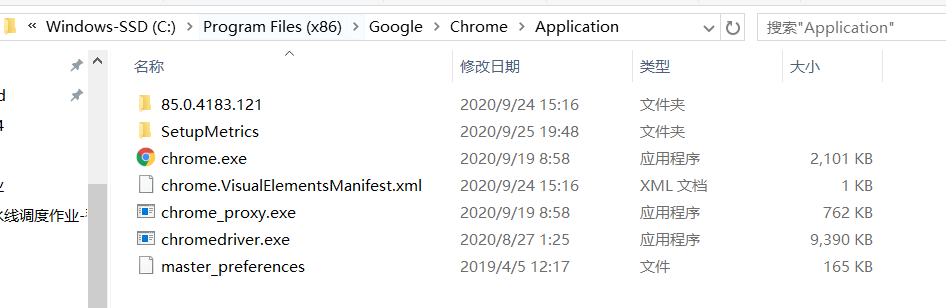
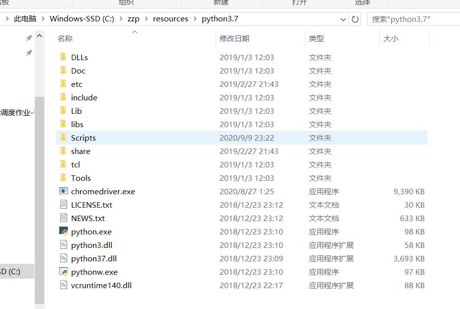
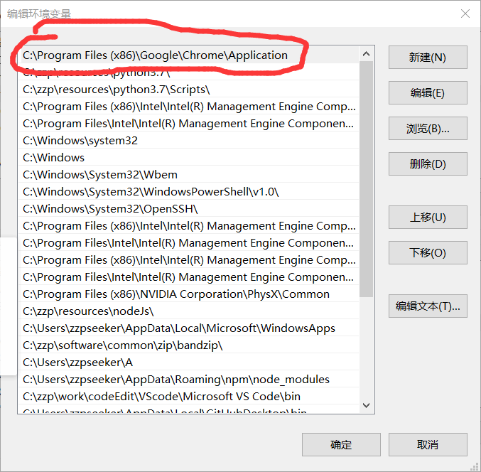
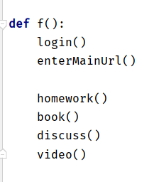

# 工程伦理mooc脚本
自动**二倍速刷课**、**刷题**、**讨论**、**看书**等除了期末考试以外所有内容，仅限工程伦理。如果是其他课请看源码自行修改部分参数即可。可多线程运行，但建议还是单线程稳定一些。

## 使用方法：

最新版本代码：[📎t (4).zip](https://www.yuque.com/attachments/yuque/0/2020/zip/567404/1602523122644-e001e2ea-f30e-4dc1-81a5-cf2314c3b6e7.zip)

### 环境配置：* *

运行环境：python3.6或3.6+

仅需要 pip install selenium

**仅限谷歌浏览器：**

https://chromedriver.chromium.org/ 下载chromedriver（windows用户下载win32，mac用户下载mac），一定要下载与本身谷歌浏览器匹配的版本（在设置->关于chrome可查看谷歌版本号），85开头就下85版本，将其中的文件（windows用户为chromedriver.exe）解压到谷歌安装目录（windows用户为 C:\Program Files (x86)\Google\Chrome\Application ）下以及python.exe同级目录下，并将谷歌安装目录加入环境变量。

示例：

解压chromedriver.exe到谷歌安装目录

解压chromedriver.exe到python.exe同级目录

加入谷歌安装目录到环境变量：

做完以上操作之后直接运行即可（命令行内输入python <文件路径>\t1.py 或 拿pycharm等软件打开运行）

### 注意事项：

1. 请先关注雨课堂公众号绑定微信，第一次运行脚本时打开网页请于**60s**内扫码登录，并等待至60s结束，之后运行无需扫码。若未完成该操作或者想更改用户请删除cookies.txt重新运行。
2. 可自行调换homework（作业）、book（书）、discuss（讨论）、video（视频）函数顺序
3. 习题内主观题有预设答案，如若想自己做请自行修改answer.txt主观题答案内容~
4. 讨论题是从近10个同学答案里随机挑选一位进行copy，如若不想这么做请注释掉discuss函数并自己手动做~
5. 请关闭vpn或设置代理模式为直连再运行
6. 如若想二倍速看视频，页面不要隐藏
7. 转载或分享请先联系我，qq：957715602  wechat：18511020743 谢谢~

##  

## 版本信息：

### V3.0(2020/10/6)：

脚本代码：[📎t (4).zip](https://www.yuque.com/attachments/yuque/0/2020/zip/567404/1602523122644-e001e2ea-f30e-4dc1-81a5-cf2314c3b6e7.zip)

**更新特性：**应对页面改版

原来还以为脚本被发现，页面突然改版，而且改的莫名其妙，每个视频其上多加一个列表，每个列表仅有本身一个元素，毫无道理。故猜测是应对脚本，于是我运行了一下脚本，果不其然报错。故进行修改。道高一尺魔高一丈。

### V2.0(2020/10/6)：

脚本代码：[📎t (3).zip](https://www.yuque.com/attachments/yuque/0/2020/zip/567404/1601968061099-e1a1a46e-800b-4b3d-a29e-0c5cf7c3ef93.zip)

**更新特性**：通过巧妙的操作实现二倍速

并不是在V1.0不实现二倍速，而是因为可能观看视频界面有一些隐藏的限制，导致普通的click无法执行。

**具体描述为**：我们需要鼠标悬浮到速度按钮，然后找到速度列表里第一个元素，即2倍速按钮，然后单击。然而这种方法不能实现，通过webdriver代码操控的直接鼠标移到速度按钮后虽然可以浮现速度列表，然而代码执行click无反应，且浮现速度列表状态下按f12在控制台内通过js执行单机操作也不行，然而奇怪的是我们手动把鼠标放在速度按钮上浮现速度列表后在控制台内执行单机二倍速按钮操作却成功。猜测是由于网页哪里加入了一些隐藏条件来限制脚本操作。

于是经过反复尝试，我们模拟人类手动操作，具体表现为AC(driver).move_to_element(speed_button).move_by_offset(-1,-1).move_by_offset(1,1).move_by_offset(-1,1).move_by_offset(1,-1).perform()

在代码操作模拟鼠标移到速度按钮后，我们让其反复横跳，像人类一样，并且我们加入js代码addEventListener("mouseover", function( event ) {｝）在其反复横跳过程中触发mouseover（不要在AC动作串最后加入click，否则仍然不可执行），并在其触发函数内加入点击二倍速按钮操作，即可实现二倍速。

整体运行时间估测：**6h**

#### 该版本案例（可参考）：

舍友：10/6  晚上运行一晚二倍速看视频完毕，暂无bug发生

### V1.0(2020/10/5)：

#### 脚本描述：

自动刷课、刷题、讨论、看书等除了期末考试以外所有内容，仅限工程伦理。如果是其他课请看源码自行修改部分参数即可。可多线程运行，但建议还是单线程稳定一些。

脚本代码[📎t.zip](https://www.yuque.com/attachments/yuque/0/2020/zip/567404/1601907668270-b5a4bab4-f6ac-4ffa-a50a-5f4080af0758.zip)

#### 该版本案例（可参考）：

舍友：10/5  22：55 从零挂机运行至 10：26全部完毕，暂无bug发生